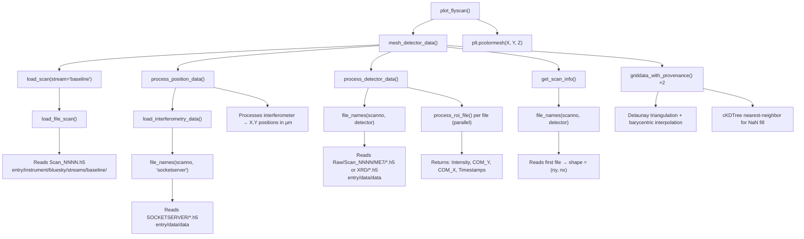

# Mictools Codebase Walkthrough — ReprocessScanMictools.py

> Full trace of the call chain from your script through Pedro's library, with notes on XRD readiness.

---

## What ReprocessScanMictools.py Does

Your script is a thin control panel around **one function call**: `plot_flyscan()`. Everything else is setup.

```
ReprocessScanMictools.py
│
├── set_path(...)              ← config.py: stores the base data directory globally
├── Roi(0, 7, 1730, 1760)     ← roi_utils.py: defines an ROI box on the D1×D2 plane
│
└── plot_flyscan(405, 'me7', roi, 'Intensity')   ← plot_data.py: the main wrapper
```

---

## Complete Call Chain

Here's every function called, in order, when you run `plot_flyscan()`:



---

## Module-by-Module Summary

### [config.py](file:///Users/scott/Documents/Postdoc/Code/mictools/mictools/config.py) — 12 lines
A global variable store. `set_path()` / `get_path()` — that's it.

---

### [roi_utils.py](file:///Users/scott/Documents/Postdoc/Code/mictools/mictools/roi_utils.py) — 11 lines
The `Roi` class: a named bounding box `(y_start, y_end, x_start, x_end)`.

- For **XRF** (`me7`): y = detector elements (0–7), x = spectral channels (0–4095)
- For **XRD** (`xrd`): y and x = **pixel coordinates on the diffraction detector image**

> [!IMPORTANT]
> The ROI means different things for different detectors. For XRD, the ROI defines a rectangle on the 2D diffraction image (e.g., isolating a specific Bragg peak), not spectral channels.

---

### [load_data.py](file:///Users/scott/Documents/Postdoc/Code/mictools/mictools/load_data.py) — 104 lines

| Function | Purpose |
|----------|---------|
| `file_names(scanno, detector)` | Glob for `Raw/Scan_NNNN/DETECTOR/scan_NNNN_*.h5` |
| `get_scan_info(scanno, detector)` | Returns `{'num_files': N, 'file_len': M, 'shape': (M, N)}` |
| `load_scan(scanno, stream)` | Loads the master scan HDF5 — primary data or baseline metadata |
| `load_file_scan(scanno, stream)` | The file-based backend for `load_scan` |
| `load_interferometry_data(scanno)` | Loads SOCKETSERVER files → DataFrame of interferometer positions |
| `load_image_from_scan(imno, scanno, detector)` | **Loads a single detector frame** by global trigger index |
| `load_cat()/load_cat_scan()` | Catalog-based loading via `apstools` (requires database connection) |

> [!TIP]
> `load_image_from_scan()` is directly relevant for XRD work. Given a trigger index, it calculates which file and which frame within that file, and returns the **raw 2D detector image**. For the XRD detector, this is the full diffraction pattern at that spatial point.

---

### [process_data.py](file:///Users/scott/Documents/Postdoc/Code/mictools/mictools/process_data.py) — 303 lines

The core processing pipeline. Three main functions:

#### `process_roi_file(file, roi)` — per-file worker
- Opens one HDF5 file at `entry/data/data`
- Slices data to the ROI: `dset[:, y_start:y_end, x_start:x_end]`
- Computes per-frame:
  - **Intensity** — `np.sum(data_roi, axis=(1,2))` (total counts in ROI)
  - **COM_Y** — weighted center-of-mass along y-axis of ROI
  - **COM_X** — weighted center-of-mass along x-axis of ROI
  - **Timestamps** — from `entry/instrument/NDAttributes/NDArrayTimeStamp`

#### `process_detector_data(scanno, detector, roi)` — orchestrator
- Checks for cached CSV at `Processed/{detector}/Scan_NNNN_{roi.name}.csv`
- If not cached: calls `process_roi_file()` in parallel (multiprocessing Pool)
- Returns a DataFrame with columns: `['Timestamp', 'Intensity', 'COM_Y', 'COM_X']`
- Saves result as CSV for future runs

#### `mesh_detector_data(scanno, detector, roi, roi_type)` — the main pipeline
1. Loads baseline metadata → extracts `sample_theta`
2. Calls `process_position_data()` → DataFrame of `(Trigger, X_Position, Y_Position)` in µm
3. Calls `process_detector_data()` → DataFrame with ROI measurements
4. Aligns lengths (position vs detector data may differ by ±1 trigger)
5. Gets scan shape `(ny, nx)` from `get_scan_info()`
6. Creates regular grid via `np.meshgrid`
7. **Interpolates** using your `griddata_with_provenance()`:
   - `method='linear'` → Delaunay + barycentric (smooth, NaN outside convex hull)
   - `method='nearest'` → cKDTree fill for gap pixels
   - `Z = where(isnan(Z_linear), Z_nearest, Z_linear)`
8. Returns `(X, Y, Z)` — the meshgrid coordinates and interpolated 2D map

---

### [process_position_data()](file:///Users/scott/Documents/Postdoc/Code/mictools/mictools/process_data.py#L189-L260) — position pipeline

- Loads SOCKETSERVER interferometry data
- Groups by trigger number (`Counter3`), averages
- Computes corrected X, Y positions using 3 interferometer channels each:
  - X: average of `I15`, `I10`, `I11`, then `x_pos = -sqrt(x_avg² + z²)`
  - Y: average of `I7`, `I8`, `I9`
- Converts from interferometer counts to µm (÷ 10⁴)
- Zeros to first point origin
- Caches to `Processed/SOCKETSERVER/Scan_NNNN_position.csv`

---

### [interp_utils.py](file:///Users/scott/Documents/Postdoc/Code/mictools/mictools/interp_utils.py) — 99 lines

Your provenance-tracking interpolation replacement. Drop-in for `griddata` that additionally returns:
- `provenance_indices` — shape `(ny, nx, 3)`: which 3 raw trigger indices contributed to each pixel
- `provenance_weights` — shape `(ny, nx, 3)`: the barycentric weights

This is currently wired into `mesh_detector_data()` (you replaced the original `griddata` calls), but the provenance arrays are **computed then discarded** — they're not returned to `plot_flyscan()`.

---

### [plot_data.py](file:///Users/scott/Documents/Postdoc/Code/mictools/mictools/plot_data.py) — 118 lines

| Function | Purpose |
|----------|---------|
| `plot_flyscan()` | Calls `mesh_detector_data()`, then `plt.pcolormesh()` with colorbar |
| `plot_meshed_data()` | Generic plotter for pre-computed (X, Y, Z) |
| `plot_sum_detector_image()` | Plotly heatmap of summed detector images — **directly relevant for XRD** |

---

### [data_proc.py](file:///Users/scott/Documents/Postdoc/Code/mictools/mictools/data_proc.py) — 228 lines

Pedro's **alternative/older** processing pipeline. Not used by `ReprocessScanMictools.py` but contains useful functions:

| Function | Purpose |
|----------|---------|
| `load_xspress3()` | Loads all ME7 files → concatenated `(N, 7, 4096)` array |
| `process_xps3_data()` | Full XRF pipeline: loads data, loads positions, interpolates, returns element maps |
| `process_interferometry_data()` | Alternative position processing with coarse offset correction |
| `get_xy_positions_from_nexus()` | Extracts scan center from bluesky metadata YAML |

---

### [peak_modelling.py](file:///Users/scott/Documents/Postdoc/Code/mictools/mictools/peak_modelling.py) — 195 lines

Peak fitting tools using `lmfit` (PseudoVoigt + Linear background). Three functions:
- `fit_scan()` — Fits a 1D scan (e.g., rocking curve) with visualization
- `graph_run()` — Overlays fitted scans across a series
- `analyze_run()` — Interactive widget: fit params vs z-variable

> [!NOTE]
> These are designed for **1D scan analysis** (e.g., theta scans, energy scans) — not spatial mapping. They use `load_scan()` to get primary stream data, not the fly-scan detector files.

---

## Data Flow: From Script to Plot

```
┌─────────────────────────────────────────────────────────────────────┐
│  ReprocessScanMictools.py                                           │
│  set_path('/Volumes/data1/isn/2026-1/2026-1-Harder')               │
│  roi = Roi(0, 7, 1730, 1760, name='Mo_Ka')                        │
│  plot_flyscan(405, 'me7', roi, 'Intensity')                        │
└──────────────────────────┬──────────────────────────────────────────┘
                           │
                           ▼
┌─────────────────────────────────────────────────────────────────────┐
│  mesh_detector_data(405, 'me7', roi, 'Intensity')                  │
│                                                                     │
│  Step 1: load_scan(405, 'baseline')                                │
│          → sample_theta for position correction                     │
│                                                                     │
│  Step 2: process_position_data(405)                                │
│          → SOCKETSERVER files → interferometry → (X, Y) in µm      │
│          → cached to Processed/SOCKETSERVER/Scan_0405_position.csv │
│                                                                     │
│  Step 3: process_detector_data(405, 'me7', roi)                    │
│          → Raw/Scan_0405/ME7/*.h5 → parallel ROI processing        │
│          → DataFrame: [Timestamp, Intensity, COM_Y, COM_X]         │
│          → cached to Processed/ME7/Scan_0405_Mo_Ka.csv             │
│                                                                     │
│  Step 4: get_scan_info(405, 'me7')                                 │
│          → shape = (ny, nx)                                         │
│                                                                     │
│  Step 5: griddata_with_provenance(pts, intensity, grid, 'linear')  │
│          griddata_with_provenance(pts, intensity, grid, 'nearest') │
│          → Z = hybrid linear/nearest interpolated image             │
│                                                                     │
│  Returns: X, Y, Z  (meshgrid coords + 2D interpolated map)        │
└──────────────────────────┬──────────────────────────────────────────┘
                           │
                           ▼
┌─────────────────────────────────────────────────────────────────────┐
│  plot_flyscan() → plt.pcolormesh(X, Y, Z)                         │
│  Colorbar label: 'Intensity'                                       │
│  Title: 'Scan 405 - me7 - Mo_Ka'                                  │
│  Axes: X (µm) vs Y (µm), aspect='equal'                           │
└─────────────────────────────────────────────────────────────────────┘
```

---

## XRD: What's Already There

The mictools pipeline **already supports XRD** through the same `process_roi_file()` → `mesh_detector_data()` → `plot_flyscan()` chain. The key difference is what the ROI means:

| Parameter | XRF (`me7`) | XRD (`xrd`) |
|-----------|-------------|-------------|
| Detector files | `Raw/Scan_NNNN/ME7/` | `Raw/Scan_NNNN/XRD/` |
| Data shape per file | `(N, 7, 4096)` — frames × elements × spectrum | `(N, detector_height, detector_width)` — frames × pixels |
| ROI y_start:y_end | Detector elements (0–7) | **Row range** on 2D detector |
| ROI x_start:x_end | Spectral channels (0–4095) | **Column range** on 2D detector |
| `Intensity` roi_type | Sum of XRF counts in channel range | **Sum of diffraction intensity** in pixel ROI |
| `COM_X` roi_type | Center of mass in spectral-channel space | **Center of mass of Bragg peak** along x-pixel axis |
| `COM_Y` roi_type | Center of mass in detector-element space | **Center of mass of Bragg peak** along y-pixel axis |

### Already working for XRD:
- ✅ `plot_flyscan(scanno, 'xrd', roi, 'COM_X')` — maps where a Bragg peak center shifts spatially (Pedro's Diamond example)
- ✅ `plot_flyscan(scanno, 'xrd', roi, 'Intensity')` — maps total diffraction intensity in a peak
- ✅ `plot_sum_detector_image(scanno, 'xrd')` — view the summed diffraction pattern to identify ROIs
- ✅ `load_image_from_scan(trigger_idx, scanno, 'xrd')` — extract a single diffraction frame

### What you'd need to get started with XRD:

1. **Find your XRD data shape** — Run `get_scan_info(SCAN_NUM, 'xrd')` to see the detector dimensions and number of files
2. **View a summed diffraction image** — Use `plot_sum_detector_image()` or manually sum some frames to see where the Bragg peaks land on the detector
3. **Define ROIs around Bragg peaks** — Once you see the pattern, `Roi(y_start, y_end, x_start, x_end)` where y/x are pixel coordinates boxing a peak
4. **Map COM or Intensity** — Same `plot_flyscan()` call, just with `detector='xrd'` and appropriate ROI

> [!TIP]
> Pedro's example in your [Pedro_Workflow_Notes.md](file:///Users/scott/Documents/Postdoc/Code/mictools/Scott%20Analysis/Pedro_Workflow_Notes.md) already shows an XRD workflow: `diamond_roi = Roi(881, 922, 498, 555)` followed by `plot_flyscan(885, 'xrd', diamond_roi, roi_type='COM_X')`. The exact same pattern will work for your MoS₂ Bragg peaks — you just need to find the right pixel coordinates.

---

## Open Questions for Next Steps

1. **What scans have XRD data?** Not all scans may have collected XRD simultaneously. Do you know which scan numbers to target?
2. **What are you looking for in the XRD?** Strain mapping (COM shifts), texture (intensity), phase identification? This determines what `roi_type` and analysis approach to use.
3. **Provenance is computed but discarded** — Your `interp_utils.py` changes work, but `mesh_detector_data()` doesn't return the provenance arrays. Do you still want to wire that up, or is it lower priority vs getting XRD running?
